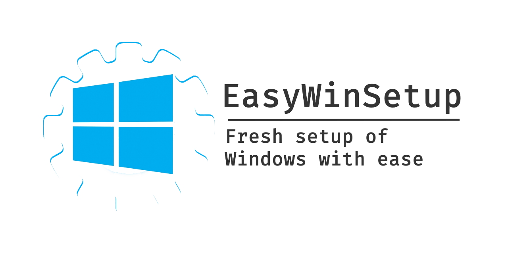

<p align="center">
  <a href="https://github.com/neilime/easy-win-setup" target="_blank"></a>
  <br/><br/>
</p>

# Summary

📢 Portable utility to setup and configure Windows

# Contributing

👍 If you wish to contribute to this project, don't hesitate, I'll review any PR.

# Download

📥 https://github.com/neilime/easy-win-setup/releases

# Features

## Drivers update

Helping to updtate drivers through [Driver cloud](https://www.driverscloud.com/)

## Uninstall useless softwares

Helping to uninstall useless softwares

## Delete useless startup entries

Helping to delete useless startup entries

## Chocolatey installation

* Installs [Chocolatey](https://chocolatey.org/).
* Installs Chocolatey packages from given [package config](https://chocolatey.org/docs/commandsinstall#packagesconfig).
  Example: `chocolatey-packages.config`
  ```xml
  <?xml version="1.0" encoding="utf-8"?>
  <packages>
    <package id="ccleaner" />
    <package id="vscode" packageParameters="/NoDesktopIcon /NoQuicklaunchIcon" />
  </packages>
  ```

## Customization of UI

### Enabling Dark mode
### Enabling the display of file extensions
### Create desktop folders

Creates some desktop folders (for tidying up) from given config

Example: `desktop-folders.config`
```csv
Name,Icon
Browsers,14
Dev,93
Multimedia,115
```
### Creates desktop "Maintenance" shortcut

Creates a shortcup that execute:
- [Chocolatey upgrade](https://chocolatey.org/docs/commands-upgrade)
- [CCleaner](https://www.ccleaner.com) auto clean, if installed
- [npm-check](https://www.npmjs.com/package/npm-check) interactive update, if installed

## Dev configuration

### Configure VSCode if installed

- Install extension [Settings Sync](https://marketplace.visualstudio.com/items?itemName=Shan.code-settings-sync)

### Install npm global packages if npm is available

## Run CCleaner if available